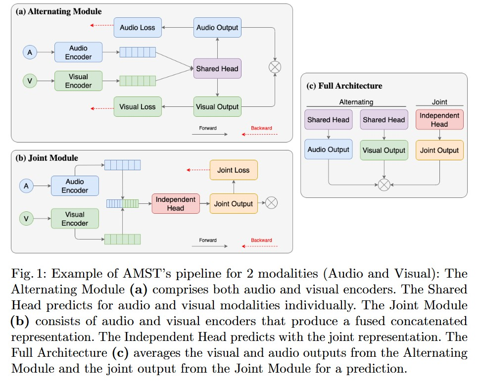
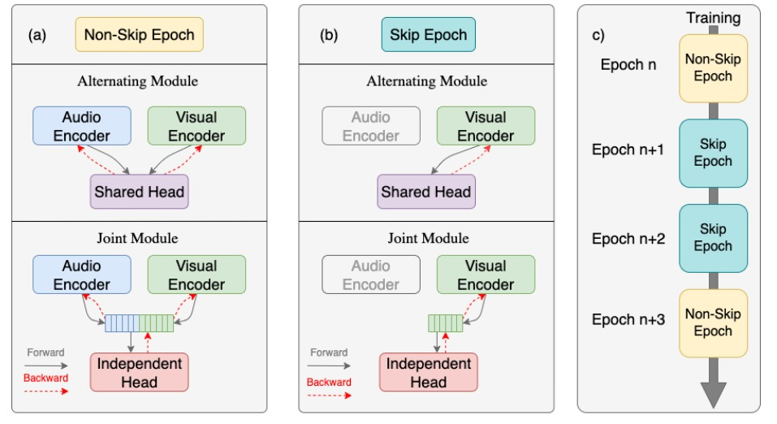

This repository contains the official implementation of our paper: AMST: Alternating Multimodal Skip Training ([pre-print](https://ecmlpkdd-storage.s3.eu-central-1.amazonaws.com/preprints/2025/research/preprint_ecml_pkdd_2025_research_372.pdf)).

The code has been refactored from the initial version, with efforts made to keep it as clean and readable as possible.
We strive to maintain consistency with the version used in our paper.

If you encounter any issues or have suggestions, your feedback is highly appreciated.
We ([@hugoesilva](https://github.com/hugoesilva) and [@CXianRen](https://github.com/CXianRen/)) will do our best to maintain and improve this repository—although, as you might understand, it can sometimes be challenging.

During the refactoring, we also found some bugs and fixed them in MLA original code and the MSLR code, so the results will be different. And baseline parameters are from their original papers, if they are not provided, we just used the default one. 


# Citation info
First, our code is based on these repors:  
[MLA](https://github.com/CXianRen/MLA)  
[PMR](https://github.com/CXianRen/PMR)  
[OGM-GE](https://github.com/CXianRen/OGM-GE_CVPR2022)

Our citation bib:
```
@misc{silva2025amst,
  author = {Silva, Hugo Manuel Alves Henriques e and Chen, Hongguang and Selpi},
  title = {AMST: Alternating Multimodal Skip Training},
  year = {2025},
  note = {ECML PKDD 2025 Preprints},
  url = {https://ecmlpkdd-storage.s3.eu-central-1.amazonaws.com/preprints/2025/research/preprint_ecml_pkdd_2025_research_372.pdf}
}
```

# Structure


# Skipping


# Env
Most time it should work:
```sh
pip install -r requirement.txt
```

# Dataset
| Dataset   | V | A | T | Link                                         | Example         |
|-----------|---|---|---|----------------------------------------------|-----------------|
| CREMAD    | √ | √ | × | [CREMAD](./Doc/dataset/CREMAD.md)           | |
| AVE       | √ | √ | × | [AVE](./Doc/dataset/AVE.md)                 |  |
| MVSA      | √ | × | √ | [MVSA](./Doc/dataset/MVSA.md)               |  |
| IEMOCAP   | √ | √ | √ | [IEMOCAP](./Doc/dataset/IEMOCAP.md)         |  |
| UR-FUNNY  | √ | √ | √ | [UR-FUNNY](./Doc/dataset/UR-FUNNY.md)       |  |

* For CREMAD dataset, in previous work, they didn't have a validating set, so we split it into 80% training, 10% validating, 10% testing.  

* Similar handling for all other dataset without a validating set.

* For AVE dataset, we used the original splited train valid and test set. But we notice there some samples have more than one labels. 


# How to run
Most running srcripts you can find it under the "./Jobs/xx.sh".

## Test dataset
You can run a simple test for debugging when your data is ready.
```sh
python3 -m dataset.test
```

## Checkpoints
we have uploaded parts of our model ckpt and also tensorboard files here [ckpt](https://drive.google.com/drive/folders/1x9TER3mc1sMgcALp7x_ooK65IjRHOaHN?usp=sharing)(Due to the space limitation, only CREMAD is uploaded). You can download and run evaluated directly with:

```sh
# single modal model
python3 -m evaluate.eval_sm --dataset CREMAD --modalit visual --model_path `[YOUR CHECKPOINTS PATH]`
```

```sh
# multimodal model
python3 -m evaluate.eval_mm --model_path `[YOUR CHECKPOINTS PATH]`
```

```sh
# AMST-FULL, use this one
python3 -m evaluate.eval_amst_f --model_path `[YOUR CHECKPOINTS PATH]`
```
## Some training logs
[some logs](Doc/Logs)


## Train baseline & AMST 
check scripts:
```sh
Jobs/naive.sh
Jobs/mla.sh
Jobs/ogm3.sh
Jobs/pmr.sh
Jobs/mla.sh
Jobs/single_modality.sh

Jobs/amst_a.sh
Jobs/amst_j.sh
Jobs/amst_f.sh
```
